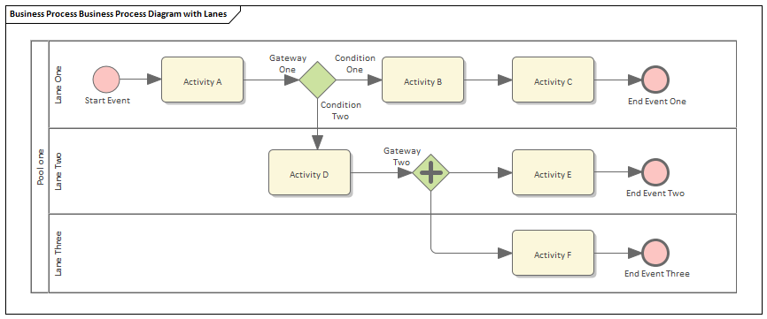
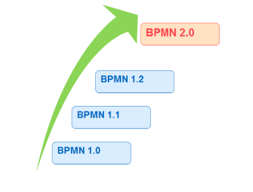
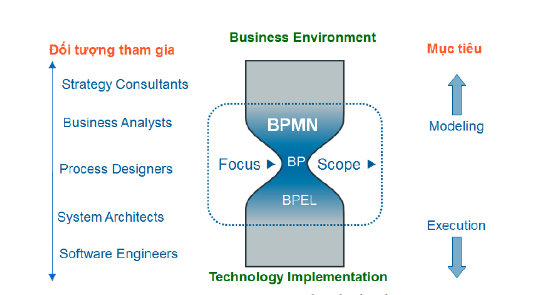
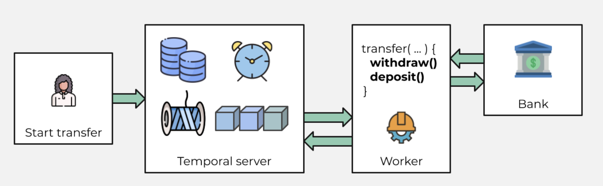

# Business Process Model and Notation

Các câu hỏi cần giải quyết

- [x] BPMN là gì?
- [x] Lịch sử phát triển?
- [x] Tác dụng của nó là gì?
- [x] Các thành phần trong BPMN
- [x] Các platform hiện tại
- So sánh cơ bản các platform
- Chọn 1 và lý do tại sao?
- platform giaỉ quyết điều gì?

## BPMN là gì?

BPMN là cụm từ viết tắt Business Process Modeling Notation, chúng ta có thể hiểu BPMN là tập hợp các ký hiệu để mô hình hóa trực quan các quy trình nghiệp vụ xử lý.

Mục đích chính là cung cấp các ký hiểu để giúp cả người không làm kỹ thuật lần người làm kỹ thuật dễ hểu, dễ đọc. Đối với dân lập trình viên thì có trách nhiệm trong việc cài đặt, triển khai, vận hành, sử dụng công nghệ. Đối với dân business thì sẽ chịu trách nhiệm quản lý, giám sát quy trình và nghiệm thu kết quả.

Nhìn vảo ảnh trên chúng ta có thể thấy được BPMN được coi như là công cụ để kết nối giữa việc phân tích quy trình nghiệp vụ và việc triển khai, cài đặt.

## Lịch sử phát triển

BPMN được phát triển bới Business Process Management Initiative (BPMI).

Phiên bản 1.0 được release vào 5-2004.

6-2005, BPMI sát nhập với OMG-Object Management Group. BPMN Specification document được release bởi OMG vào 2-2006.

Phiên bản 2.0 được phát triển vào năm 2010, và nó được release vào 12-2013.

Phiên bản mới nhất 2.0.2 được ISO chính thức xuất bản dưới dạng tiêu chuẩn ISO/IEC 19510 với một số tính năng mở rộng như sau:

Hình thức hóa được ngữ nghĩa
Có sự tương quan giữa các sự kiện
Thêm nhiều ký hiệu tương tác với user
Choreography model
Các phiên bản 1.2 trở về trước thì các ký hiệu chưa nhất quán, một số ký hiệu bị nhập nhằng về ngữ nghia.

## Tác dụng

Khi chúng ta lấy yêu cầu trong buổi họp với khách hàng, một điều đặc biệt khi chúng ta làm việc với khách hàng có rất nhiều sự khó khăn khi tiếp cận với quy trình nghiệp vụ của họ. Nhiều khi chúng ta chưa mường tượng nó ra cái gì nhưng vẫn phải lắng nghe và take not vào. Sau đó về phải làm document lại. Mỗi khách hàng, mỗi doanh nghiệp lại khác nhau về quy trình nghiệp vụ, phức tạp. Document sao cho ngắn gọn, dễ đọc, dễ hiểu mà vẫn đảm bảo được đúng nội dung mà khách hàng yêu cầu. BPMN chính là giải pháp cho chúng ta.

Ưu điểm :

- Nhiều ký hiệu gần gũi quen thuộc với đời sống hằng ngày nên nhìn vào có thể hiểu được 70-80% nó đang làm cái gì cho cả dân biết tech và non-tech.
- Mô tả rõ ràng, hạn chế nhập nhằng, dễ đọc, dễ hiểu.

## Các thành phần

BPMN gồm 6 thành phần chính.

- Swimlane: linh hồn của BPMN, thể hiện hành động theo các vai trò một cách rõ ràng.
- Activity: thể hiện hành động.
- Flow: thể hiện luồng đi của hành động.
- Gateway: thể hiện các cổng điều kiện có trong quy trình.
- Event: thể hiện sự việc xảy ra trong suốt quy trình.
- Information Artifact: thể hiện các dữ liệu liên quan.

## Các platform hiện nay
Camunda, cadence, temporal, zeebe

## Temporal
Ví dụ trên template transfer money

Cách thức hoạt động:
- Gửi 1 tín hiệu thời temporal server để bắt đầu chuyển tiền. Temporal server sẽ track quá trình sử lý
- Run worker để thực hiện flow chuyển tiền và tracking là vào server

## Những gì temporal có thể thực hiện

- Show và tracking lại được quá trình làm việc
- Automatic retries
- Fix bug on the fly: resume lại khi bug được fix

## Tham khảo

http://www.bpmn.org/ 

https://docs.temporal.io/docs/overview/

https://docs.temporal.io/docs/java-run-your-first-app/

https://viblo.asia/p/tim-hieu-ve-mo-hinh-quy-trinh-nghiep-vu-bpmnphan-1-oOVlYMNrl8W

https://thinhnotes.com/chuyen-nghe-ba/giai-ngo-cac-ky-hieu-bpmn/
# bpmn
